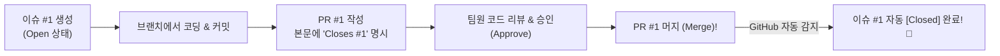

# 📖 EXPLAIN FOR ME : Git 실전 협업 "이게 뭐고, 왜 하는가?"

> **문서 목적**: 과제를 진행하면서 거치는 단계들(브랜치 보호, Issue, PR, 코드 리뷰, 충돌 해결, 트러블슈팅)이 **"도대체 뭘 하는 프로세스인지"**, 그리고 **"이걸 하면 실무에서 뭐가 좋은지"**를 한눈에 이해할 수 있도록 알기 쉽게 정리한 친절한 설명서입니다.

---

## 📌 목차
1. [1. GitHub 브랜치 보호 규칙 (Branch Protection)](#1-github-브랜치-보호-규칙-branch-protection)
   - [Classic Rule vs Ruleset은 뭐가 다른가요?](#classic-rule-vs-ruleset은-뭐가-다른가요)
2. [2. Issue 기반 작업 & Closes # 연동](#2-issue-기반-작업--closes--연동)
3. [3. feature 브랜치 격리 개발 (GitHub Flow)](#3-feature-브랜치-격리-개발-github-flow)
4. [4. PR (Pull Request)과 최소 1인 승인 (Approval)](#4-pr-pull-request과-최소-1인-승인-approval)
5. [5. 코드 리뷰 (Code Review: LGTM 금지)](#5-코드-리뷰-code-review-lgtm-금지)
6. [6. 충돌(Conflict) 해결과 충돌 마커의 원리](#6-충돌conflict-해결과-충돌-마커의-원리)
7. [7. Git 트러블슈팅 4종 (구원투수 명령어들)](#7-git-트러블슈팅-4종-구원투수-명령어들)
8. [8. SUBMISSION.md와 Git Graph 증빙](#8-submissionmd와-git-graph-증빙)

---

## 1. GitHub 브랜치 보호 규칙 (Branch Protection)

### ❓ 이게 뭘 하는 프로세스인가요?
- 저장소의 가장 중요한 기준선인 `main` 브랜치에 **"디지털 자물쇠"**를 채우는 작업입니다.
- 개발자가 실수로 터미널에서 `git push origin main`을 치더라도, GitHub 서버가 이를 단칼에 거절하게 만듭니다.
- `main`에 코드를 넣으려면 **반드시 PR(검수 요청서)을 올리고, 다른 팀원 1명 이상이 승인(Approve) 도장을 찍어야만 머지**될 수 있도록 강제합니다.

### 💡 이걸 하면 뭐가 좋은가요? (Why & Benefits)
1. **대형 방송사고(서버 다운) 방지**:
   - 실무에서 `main` 브랜치는 실제 고객들이 이용하는 라이브 서비스(운영 서버)와 직결됩니다.
   - 테스트도 안 거친 미완성 코드나 버그가 실수로 `main`에 푸시되어 고객 서비스가 뻗어버리는 참사를 100% 원천 차단합니다.
2. **원치 않는 덮어쓰기(히스토리 파괴) 차단**:
   - 누군가 `git push -f`(강제 푸시)를 잘못 날려 다른 팀원들의 지난주 작업물이 몽땅 증발하는 사고를 방지합니다.

---

### 🔍 [궁금증] Classic Rule vs Ruleset은 뭐가 다른가요?
GitHub 웹 화면에서 보셨던 두 가지 선택지의 차이점입니다:
- **`Classic branch protection rule` (우리가 누른 것)**:
  - 수년간 전 세계 수천만 개발팀이 사용해 온 **가장 검증되고 표준적인 전통 방식**입니다.
  - 설정 창 하나에서 "PR 필수", "1명 승인 필수"만 체크하면 30초 만에 끝나 가장 직관적입니다.
- **`Ruleset` (새로운 방식)**:
  - 대기업이나 수백 개 저장소를 운영하는 조직을 위해 GitHub가 최근 추가한 고급 기능입니다.
  - 여러 브랜치에 복잡한 규칙을 한 번에 배포할 때 쓰지만, 소규모 팀 프로젝트에서는 Classic Rule이 훨씬 간결하고 실수를 줄여줍니다.

---

## 2. Issue 기반 작업 & Closes # 연동 : "우리는 왜 코딩 전에 이슈부터 만드는가?"

### ❓ 이게 뭘 하는 프로세스인가요?
- 코드를 한 줄이라도 에디터에 치기 전에, GitHub의 **[Issues] 탭에 "내가 오늘 무엇을, 왜 만들 것인지" 작업 티켓(할 일 카드)**을 먼저 등록하는 프로세스입니다.
- 그리고 개발이 끝난 뒤 올리는 PR(풀 리퀘스트) 본문에 `Closes #1`이라고 키워드를 적어두면, PR이 `main`에 머지되는 순간 GitHub 로봇이 `Issue #1`을 **자동으로 [Closed] 상태로 완료 처리**해 줍니다.

---

### 🍳 핵심 비유로 이해하기
> **"이슈(Issue)는 식당의 [주문서], 건축의 [설계도], 병원의 [진료 차트]입니다."**
- **주문서 없는 식당**: 손님이 "짜장면 하나요" 했는데 홀 직원이 말로만 전하면, 주방장이 짬뽕을 만들거나 요리사 두 명이 각자 짜장면을 두 그릇 만들어 낭비가 생깁니다.
- **설계도 없는 공사**: 인부들이 각자 자기 감대로 벽돌을 쌓다가 나중에 창문 위치가 안 맞아 건물을 통째로 부숴야 합니다.
- **주문서(이슈)가 있으면**: 주문 번호(#1), 주문 메뉴(토너먼트 엔진), 조리 담당자(안재현), 진행 상태(조리 중 -> 서빙 완료)가 모든 직원에게 투명하게 보입니다.

---

### 💡 실무에서 이슈를 안 만들면 터지는 5대 참사 (Why we MUST create Issues)

만약 "에이, 어차피 코드 짤 건데 이슈는 왜 귀찮게 먼저 써?" 하고 바로 코드부터 짜면 실무에서 다음과 같은 대형 참사가 발생합니다:

1. **카우보이 코딩 (Cowboy Coding)과 헛수고**:
   - 기획 의도를 혼자 마음대로 짐작해서 주말 내내 밤새워 3,000줄을 짰는데, 월요일 팀 회의에서 *"어? 재현님, 그거 지난주 고객 인터뷰에서 필요 없다고 결론 났는데요?"*라는 말을 듣고 코드 전체를 휴지통에 버리게 됩니다.
   - **이슈를 쓰면**: 코딩 전에 "이거 만들겠습니다"라고 이슈를 올리고 팀원들의 피드백을 먼저 받으므로 헛수고를 100% 방지합니다.

2. **작업 중복 (Duplicate Effort)의 비극**:
   - 안재현도 `음식 데이터 로더`를 짜고 있고, 옆자리 강동하도 `음식 데이터 로더`를 짜고 있는 상황이 발생합니다.
   - 나중에 머지할 때 둘의 코드가 충돌하고, 결국 둘 중 한 명의 3일간의 피땀은 그대로 쓰레기통으로 들어갑니다.
   - **이슈를 쓰면**: `[FEAT] 음식 데이터 로더 구현 (담당자: 강동하)` 티켓이 떠 있으므로, 다른 팀원은 자신이 할 일에만 집중할 수 있습니다.

3. **맥락 없는 유령 코드 (Ghost Code)와 기술 부채**:
   - 1년 뒤 새로운 신입 개발자나 본인이 과거 코드를 봤을 때, `if count == 2: return "결승전"` 같은 코드를 보고 *"이 예외 처리가 도대체 무슨 장애 때문에 들어간 거지? 지워도 되나?"*를 아무도 모릅니다.
   - **이슈를 쓰면**: Git 히스토리에서 해당 라인의 커밋 ➔ PR ➔ 연결된 `Issue #1`을 클릭하면, 1년 전 당시에 *"왜 이 코드를 작성했는지"* 기획 문서와 토론 댓글이 고스란히 남아 있어 1초 만에 의도를 파악할 수 있습니다. 이것을 전문 용어로 **'완벽한 변경 추적성(Traceability)'**이라고 부릅니다.

4. **끝없는 메신저 핑퐁 ("어디까지 됐어요?"):**
   - 이슈가 없으면 PM이나 팀장이 하루에도 대여섯 번씩 *"재현님 그거 어디까지 됐어요?", "동하님 다 끝났어요?"* 물어보며 개발자의 집중 흐름(Flow)을 끊어놓습니다.
   - **이슈를 쓰면**: GitHub Projects 칸반 보드에서 이슈 카드가 `To Do ➔ In Progress ➔ Done`으로 이동하는 것만 보면 아무도 말을 걸지 않고도 팀 전체의 진행 상황을 실시간으로 알 수 있습니다.

5. **채점관 / 기술 면접관의 시선 (신입과 주니어의 차이)**:
   - 평가관이나 시니어 개발자는 깃허브 저장소를 볼 때 코드만 보지 않습니다.
   - **아마추어 학생**: 이슈 없이 커밋만 10개 덩그러니 있음 ("혼자 자기 멋대로 짠 토이 프로젝트").
   - **프로페셔널 개발자**: Issue #1 발행 ➔ 브랜치 생성 ➔ PR #1에 `Closes #1` 연결 ➔ 코드 리뷰 반영 후 머지 ("실무 현업의 협업 문화를 완벽히 체화한 인재!").

---

### 🤖 `Closes #1` 자동화의 마법 (Magic Keyword)

PR 본문에 `Closes #1` (또는 `Fixes #1`, `Resolves #1`)을 적으면 GitHub 백엔드 엔진에서 일어나는 일:

- **사람의 실수를 방지하는 자동화**:
  - 개발자가 머지하고 나서 "아 맞다, 웹에서 이슈 닫아야지" 하고 까먹으면, 프로젝트에 끝난 작업이 아직도 `Open`으로 방치되는 지저분한 상태가 됩니다.
  - `Closes #1` 키워드를 쓰면 코드가 머지되는 그 0.1초의 순간에 GitHub가 이슈를 대신 닫아주고, "어느 PR에 의해 이 이슈가 해결되었는지" 양방향 링크까지 영구히 기록해 줍니다.

---

### 📋 좋은 이슈의 표준 템플릿 (참고용)

좋은 이슈는 다음 3가지가 명확합니다:
1. **제목 컨벤션**: `[태그] 한 줄 명확한 목표` (예: `[FEAT] 토너먼트 대진 브래킷 상태머신 구현`)
2. **배경 & 목적 (Why)**: 왜 이 작업이 필요한지?
3. **할 일 체크리스트 (TODO)**:
   - [ ] 32/16/8강 대진표 생성 함수 구현
   - [ ] 라운드별 승자 진출 트리 상태 관리
   - [ ] 단위 테스트 작성 및 통과 검증

---

## 3. feature 브랜치 격리 개발 (GitHub Flow)

### ❓ 이게 뭘 하는 프로세스인가요?
- `main` 브랜치에서 직접 작업하지 않고, 나만의 안전한 독립 작업방인 `feature/ahn-tournament-engine` 브랜치를 파서 개발하는 프로세스입니다.

### 💡 이걸 하면 뭐가 좋은가요? (Why & Benefits)
1. **마음 편한 실험 공간 (독립성)**:
   - 내 브랜치 안에서는 코드를 지우든, 에러가 나든 다른 팀원의 코드나 `main`에 아무런 영향을 주지 않습니다.
2. **동시 다발적 병렬 개발**:
   - 안재현은 토너먼트를 짜고, 강동하는 음식 DB를 짜고, 김진우는 투표기를 짜는 작업을 각자의 브랜치에서 동시에 진행할 수 있습니다.

---

## 4. PR (Pull Request)과 최소 1인 승인 (Approval)

### ❓ 이게 뭘 하는 프로세스인가요?
- 내가 만든 `feature` 브랜치의 개발이 끝났을 때, 팀원들에게 **"내가 이렇게 만들었는데, 검토해 보고 `main` 브랜치에 합쳐줄래?"**라고 정식으로 상신하는 전자결재 서류입니다.
- 서류에는 필수 3대 항목(**What**: 뭘 바꿨는지, **Why**: 왜 바꿨는지, **How**: 어떻게 테스트했는지)을 적습니다.

### 💡 이걸 하면 뭐가 좋은가요? (Why & Benefits)
1. **나 혼자만의 착각 방지**:
   - 내가 짤 때는 완벽해 보였던 코드도 동료가 보면 빠진 예외 처리나 버그가 바로 보입니다.
2. **코드 퀄리티 상향 평준화**:
   - 머지 전에 무조건 다른 사람 1명의 눈(Approve)을 거치므로, 팀의 전체적인 코드 품질이 비약적으로 올라갑니다.

---

## 5. 코드 리뷰 (Code Review: LGTM 금지)

### ❓ 이게 뭘 하는 프로세스인가요?
- 동료의 PR 화면("Files changed")에서 줄 번호를 클릭해 질문, 개선 제안, 리스크를 지적하는 과정입니다.
- "LGTM(Looks Good To Me / 좋아 보여요)"만 성의 없이 찍는 것을 금지하고, 실제 코드 라인을 짚어 대화합니다.

### 💡 이걸 하면 뭐가 좋은가요? (Why & Benefits)
1. **지식 공유 (Knowledge Transfer)**:
   - 동료가 짠 코드를 리뷰하면서 "아, 저 기능은 파이썬에서 저렇게 짜는구나!" 하고 팀원 전체가 함께 배웁니다.
2. **경계값 버그 조기 차단**:
   - 예: `"음식 수가 0개일 때는 프로그램이 안 뻗나요?"` 같은 날카로운 질문 하나가 배포 후 터질 장애를 사전에 막아줍니다.

---

## 6. 충돌(Conflict) 해결과 충돌 마커의 원리

### ❓ 이게 뭘 하는 프로세스인가요?
- 두 개발자가 같은 파일의 같은 라인을 동시에 수정했을 때, Git이 "둘 중 누구 게 맞는지 컴퓨터인 나는 판단할 수 없어!"라며 충돌 마커(`<<<<<<< HEAD ... ======= ... >>>>>>>`)를 띄우고 작업을 멈추는 상황입니다.
- 개발자가 충돌 마커를 열어 양쪽 의견을 조율해 하나로 합치는(Keep both 또는 Refactor) 프로세스입니다.

### 💡 이걸 하면 뭐가 좋은가요? (Why & Benefits)
1. **상대방 작업물을 덮어써서 날려먹는 비극 방지**:
   - 만약 Git이 충돌을 안 띄우고 나중에 올린 사람 걸로 덮어써 버린다면, 동료의 소중한 코드가 감쪽같이 사라집니다.
2. **실무 협업의 면역력 획득**:
   - 실무에 가면 충돌은 매일 일어납니다. 충돌 마커를 읽고 해결할 줄 알면 Git이 전혀 두렵지 않게 됩니다.

---

## 7. Git 트러블슈팅 4종 (구원투수 명령어들)

실무에서 사고를 쳤을 때 팀원을 살려주는 4대 응급처치 도구입니다:

| 도구 (명령어) | 언제 쓰는가? (상황) | 이걸 쓰면 뭐가 좋은가? (효과) |
|:---|:---|:---|
| **`git commit --amend`** | 방금 친 커밋 메시지에 오타가 났거나 파일 하나를 깜빡했을 때 | 히스토리에 "오타 수정", "진짜 최종" 같은 부끄러운 땜빵 커밋을 남기지 않고 단일 커밋으로 깔끔하게 덮어씁니다. |
| **`git reset --soft HEAD~1`** | 방금 로컬에서 커밋했는데 뭔가 잘못 넣었음을 깨달았을 때 | **작업한 코드는 1바이트도 날리지 않고 그대로 살려둔 채**, 커밋 포장 박스만 쏙 뜯어내 안전하게 재작업할 수 있습니다. |
| **`git revert`** | 이미 원격(`origin`)에 올라간 커밋에서 치명적 버그가 터졌을 때 | 과거 기록을 강제로 삭제하지 않고, **기존 커밋을 정반대로 취소하는 '취소 영수증 커밋'**을 만들어 안전하게 롤백합니다. |
| **`git stash` / `pop`** | 코드 짜다 말고 급하게 다른 브랜치로 가서 버그를 확인해야 할 때 | 미완성 코드를 억지 커밋으로 남길 필요 없이 **임시 비밀 서랍장에 싹 넣어두었다가**, 돌아와서 그대로 복원합니다. |

---

## 8. SUBMISSION.md와 Git Graph 증빙

### ❓ 이게 뭘 하는 프로세스인가요?
- 프로젝트 루트에 모든 팀원의 PR 링크, 문서 링크, 그리고 터미널의 예쁜 가지치기 히스토리(`git log --graph`)를 종합 정리한 대시보드 인덱스 문서입니다.

### 💡 이걸 하면 뭐가 좋은가요? (Why & Benefits)
1. **평가관/멘토의 1초 합격 판정**:
   - 채점관이 여기저기 브랜치를 뒤적거릴 필요 없이, `SUBMISSION.md` 하나만 보고도 "이 팀은 PR 2개씩 다 채웠고, 충돌도 해결했고, 완벽하네!" 하고 즉시 만점을 줄 수 있습니다.
2. **팀의 포트폴리오 자산화**:
   - 나중에 취업 이력서나 면접에서 "저는 GitHub Flow와 코드 리뷰, 충돌 해결을 실제로 경험했습니다"라고 증명할 수 있는 결정적인 증거 자료가 됩니다.
