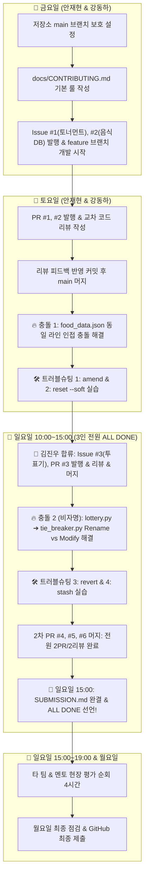

# [마스터 플랜] Git 실전 협업(b2-02) 10단계 실행 계획 & 기여도 매트릭스

> **미션**: **코디세이 b2-02 (3~5인 Git 실전 협업 시뮬레이션)**  
> **개발 프로젝트**: **한국 음식 128선 식사 추천 이상형 월드컵 (Python 모듈 기반)**  
> **핵심 과제**: GitHub Flow, 이슈-PR 연동, 1인당 PR 2개/리뷰 2개/피드백 반영 1회, 충돌 해결 2회(비자명 1회 포함), 트러블슈팅 4종, SUBMISSION.md  
> **마감 시한**: **일요일 15:00 전 기능 & 문서 100% 완결 (ALL DONE) ➔ 일요일 15:00~19:00 현장 평가 순회**

---

## 1. 프로젝트 개요 및 협업 아키텍처

본 계획은 `코디세이 b2-02`의 모든 기능 요구사항과 제약조건을 100% 충족하면서, 팀원들이 **"한국 음식 128선 식사 추천 월드컵"**이라는 명확한 프로젝트를 실제로 개발하며 Git 실무 협업을 체득할 수 있도록 설계된 마스터 계획입니다.

팀원 3인의 실제 출근 시간(안재현/강동하: 금·토·일, 김진우: 일·월)에 맞추어 **금·토에 인프라와 1차 PR/충돌/트러블슈팅을 탄탄히 다져두고, 일요일 10:00 김진우 합류 즉시 잔여 PR, 비자명 충돌, 트러블슈팅을 완결하여 일요일 15:00에 전원 과제를 마감**합니다.

---

## 2. 10단계 실행 플랜 상세 매트릭스 (일요일 15:00 완결 체제)

| 단계 | 작업명 | 핵심 산출물 및 과제 요구 충족 | 주 담당자 | 작업 시간대 |
|:---:|:---|:---|:---:|:---:|
| **Step 1** | 저장소 준비 & Branch Protection 설정 | - `main` 직접 push 금지, PR 필수, 1명 승인 필수 설정 - 기본 디렉토리(`docs/`, `src/`, `data/`, `README.md`) 구성 | 안재현 | 금 12:40 ~ 14:30 |
| **Step 2** | 팀 협업 가이드 초안 수립 | `docs/CONTRIBUTING.md` 작성 - GitHub Flow 선택 이유 3줄 기록 - 브랜치/커밋/PR/리뷰/충돌 대응 컨벤션 | 안재현 강동하 | 금 14:30 ~ 16:30 |
| **Step 3** | 1차 이슈 발행 & Feature 브랜치 개발 | - Issue #1 (안재현: `feature/ahn-tournament-engine` - 토너먼트 대진 엔진) - Issue #2 (강동하: `feature/kang-food-loader` - 음식 128선 DB & 로더) - 의미 있는 커밋 메시지 규칙 준수 | 안재현 강동하 | 금 16:30 ~ 19:00 |
| **Step 4** | 1차 PR 발행 & 상호 교차 코드 리뷰 | - PR #1, PR #2 발행 (`Closes #1`, `Closes #2`, What/Why/How 명시) - **LGTM 금지, 라인 근거 실질 피드백 코멘트 작성** | 안재현 강동하 | 토 12:00 ~ 14:00 |
| **Step 5** | 리뷰 피드백 반영 커밋 & 1차 PR 머지 | - 지적 사항 수정 커밋 작성 & 답글 교환 (리뷰 반영 경험 충족) - 1명 이상 승인(Approve) 확인 후 `main` 머지 | 안재현 강동하 | 토 14:00 ~ 15:30 |
| **Step 6** | **[충돌 실습 1]** 동일 파일 인접 라인 충돌 | - `data/food_data.json` 10번 라인 동시 수정으로 충돌 유발 - 충돌 마커(`<<<<<<<`, `=======`, `>>>>>>>`) 확인 & Keep both 수동 해결 - `docs/conflict-resolution.md`에 충돌 기록 #1 작성 | 안재현 강동하 | 토 15:30 ~ 17:30 |
| **Step 7** | **[트러블슈팅 1 & 2]** `amend` & `reset` | - 강동하: `git commit --amend` (최근 커밋 오타 수정) - 안재현: `git reset --soft HEAD~1` (커밋 취소 후 스테이징 유지) - `docs/troubleshooting-log.md`에 시나리오 1, 2 기록 | 강동하 안재현 | 토 17:30 ~ 19:00 |
| **Step 8** | **[김진우 합류]** PR #3 발행/머지 & `stash` | - 김진우 Issue #3 (`feature/kim-voting-system` - 투표/동점처리기) 작업 - PR #3 발행 ➔ 안재현/강동하 리뷰 ➔ 피드백 반영 커밋 ➔ 머지 - 김진우 `git stash` / `git stash pop` 트러블슈팅 4 실습 및 기록 | 김진우 (안재현/강동하) | 일 10:00 ~ 12:30 |
| **Step 9** | **[충돌 실습 2: 비자명]** Rename vs Modify & `revert` | - 안재현 로직 수정 vs 김진우 파일 이름 변경(`git mv lottery.py tie_breaker.py`) - 3-way 머지 충돌 해결 & `docs/conflict-resolution.md` 기록 #2 - `git revert` 원격 커밋 안전 취소 트러블슈팅 3 실습 및 기록 | 안재현 김진우 | 일 12:30 ~ 14:00 |
| **Step 10** | 2차 PR 전원 머지 & **SUBMISSION.md 완결 (ALL DONE!)** | - 2차 PR(#4 안재현 게임 결합, #5 강동하 가이드 보강, #6 김진우 인덱스 완결) - **1인당 PR 2개, 리뷰 2개, 피드백 반영 1회 100% 충족** - `SUBMISSION.md`에 모든 링크 & `git log --graph` 증빙 첨부 | 3인 전원 | **🚨 일 14:00 ~ 15:00** |

---

## 3. 팀원별 기여도 최소 기준 100% 충족 배분표 (전원 만점 기준)

과제 요구사항 5번(PR 기반 협업)과 8번(트러블슈팅)의 "팀원별 최소 기준"을 단 1건의 누락 없이 전원 충족합니다:

| 요구 항목 | 👑 안재현 (Lead) | 🛠️ 강동하 | 📋 김진우 | 과제 평가 기준 |
|:---|:---:|:---:|:---:|:---:|
| **PR 생성 및 머지** | **2개** (PR #1 토너먼트, PR #4 게임통합) | **2개** (PR #2 음식DB, PR #5 가이드보강) | **2개** (PR #3 투표기, PR #6 제출인덱스) | **팀원 전원 최소 2개 이상 (총 6개) ✅** |
| **코드 리뷰 작성** | **2개** (PR #2, PR #3 리뷰) | **2개** (PR #1, PR #6 리뷰) | **2개** (PR #4, PR #5 리뷰) | **팀원 전원 최소 2개 이상 (본인 제외) ✅** |
| **리뷰 피드백 반영 커밋** | **1회 이상** (PR #1 피드백 반영) | **1회 이상** (PR #2 피드백 반영) | **1회 이상** (PR #3 피드백 반영) | **팀원 전원 최소 1회 이상 반영/답글 ✅** |
| **충돌 해결 실습** | **참여** (충돌 #1, 충돌 #2 해결) | **참여** (충돌 #1 food_data 인접라인) | **참여** (충돌 #2 비자명 Rename) | **팀 전체 2회 이상 (비자명 1회 포함) ✅** |
| **트러블슈팅 실습 참여** | **2건** (`reset --soft`, `revert`) | **1건** (`commit --amend`) | **2건** (`stash`, `revert`) | **팀 전체 4종 시나리오 전원 참여 ✅** |
| **결과물 코드 기여** | `src/tournament.py`, `game.py` | `data/food_data.json`, `src/food_loader.py` | `src/voting.py`, `src/tie_breaker.py` | **팀원 전원 최소 1건 이상 커밋 기여 ✅** |
| **필수 문서 작성/기여** | Branch Protection, conflict 로그 | CONTRIBUTING.md, amend 로그 | SUBMISSION.md, stash 로그 | **협업 문서 3종 + SUBMISSION 완비 ✅** |

---

## 4. 과제 산출물 매핑 가이드

- **제출 인덱스**: `SUBMISSION.md` (루트 디렉토리)
- **협업 문서 3종**:
  - `docs/CONTRIBUTING.md`
  - `docs/conflict-resolution.md`
  - `docs/troubleshooting-log.md`
- **결과물 코드**:
  - `data/food_data.json` (한국 음식 128선 DB)
  - `src/food_loader.py` (음식 로더 모듈)
  - `src/tournament.py` (토너먼트 대진 엔진)
  - `src/voting.py` (다인원 순차 투표기)
  - `src/tie_breaker.py` (동점 추첨기)
  - `game.py` (식사 추천 월드컵 메인 실행기)
- **히스토리 증빙**: `git log --oneline --graph --all` 결과 텍스트 및 스크린샷 링크
