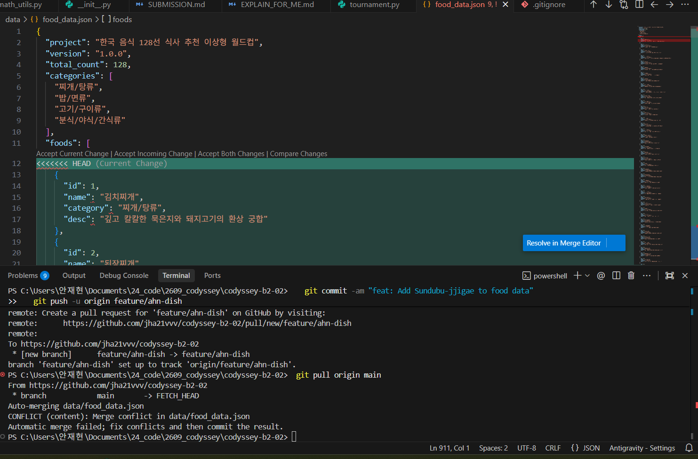
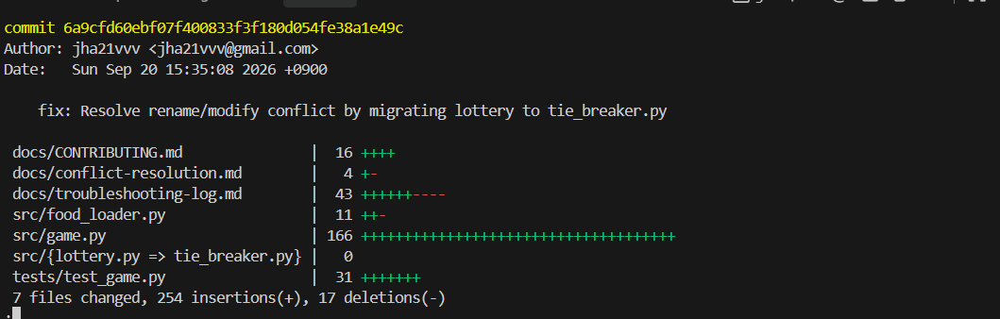

# Conflict Resolution Log

> **과제 요구사항**: 의도적으로 충돌 상황을 만들고 해결한 기록을 남긴다.  
> - 팀 전체 기준: 최소 2회 이상 충돌 해결 기록 (비자명 충돌 최소 1회 포함)  
> - 충돌 1: 같은 파일의 같은 hunk (인접 라인) 수정 충돌 (`data/food_data.json`)  
> - 충돌 2: 비자명 충돌 (파일 Rename vs 내용 Modify 충돌: `src/lottery.py` ➔ `src/tie_breaker.py`)

---

## 충돌 기록 #1: 동일 파일 인접 라인 충돌 (Adjacent Line Conflict)

### 참여자
- 작성자: **안재현**
- 상대: **강동하**

### 실전 증빙 캡처


### 상황 (What happened)
- **대상 파일**: `data/food_data.json` (한국 음식 128선 데이터셋)
- **발생 브랜치**: `feature/ahn-dish` 와 `origin/main` 머지 과정
- **상황 설명**:
  - 실전 충돌 및 오류 발생 재현 테스트를 위해 강동하 님이 10번 부대찌개 설명(`desc`) 필드에 `"1_"` 접두사를 추가하여 커밋함.
  - 안재현은 데이터 파일 형식(포맷팅) 전환 및 순두부찌개 데이터를 추가한 상태에서 `git pull origin main`을 수행하여 동일 라인(hunk) 충돌을 의도적으로 유발함.

### 충돌 내용 (Conflict markers)
```txt
<<<<<<< HEAD
    {"id": 10, "name": "부대찌개", "category": "찌개/탕류", "desc": "1_햄과 소시지, 라면 사리가 가득한 푸짐함"},
=======
    {"id": 10, "name": "부대찌개", "category": "찌개/탕류", "desc": "햄과 소시지, 라면 사리가 가득한 푸짐함"},
>>>>>>> feature/kang-food-loader
```

### 해결 과정 (How)
- **선택한 해결 전략**: `Clean Data Selection & Keep Both` (오탈자 정제 및 양쪽 데이터 보존)
  - 테스트용으로 삽입된 `"1_"` 오탈자 접두사를 제거하고 원래의 올바른 부대찌개 설명을 유지하며, 안재현 브랜치의 추가 음식 데이터(순두부찌개)도 유실 없이 모두 보존함.
- **수행 절차**:
  1. `data/food_data.json` 파일을 에디터로 열어 충돌 마커 확인
  2. 충돌 마커(`<<<<<<< HEAD`, `=======`, `>>>>>>>`)를 제거하고, 오탈자 정제 및 두 음식 데이터가 모두 온전히 등록되도록 정리
  3. `git add data/food_data.json`
  4. `git commit -m "fix: Resolve merge conflict in food_data.json by keeping both dishes"`
  5. `git push origin feature/ahn-dish`

### 결과 (Outcome)
- 양쪽 브랜치의 음식 데이터가 유실 없이 병합되어 128선 DB가 정상 동작함.
- **관련 PR**: [PR #7: feat: Add Sundubu-jjigae to food data](https://github.com/jha21vvv/codyssey-b2-02/pull/7)
- **충돌 해결 머지 커밋**: [`fafaa6d`](https://github.com/jha21vvv/codyssey-b2-02/commit/fafaa6d) (`fix: Resolve merge conflict in food_data.json by keeping both dishes`)
- **main 머지 커밋**: [`a72615f`](https://github.com/jha21vvv/codyssey-b2-02/commit/a72615f) (`Merge pull request #7 from jha21vvv/feature/ahn-dish`)

### 배운 점 (Learnings)
- Git은 라인 단위로 변경사항을 비교하므로 동일 객체나 인접한 필드를 동시에 수정할 때 충돌 마커를 생성함을 확인함.
- 충돌 마커의 HEAD와 상대 브랜치 영역을 정확히 읽어 테스트용 수정 사항과 실제 반영할 기능을 분별하여 안전하게 병합하는 법을 배움.

---

## 충돌 기록 #2: 비자명 충돌 (Rename vs Modify Conflict)

### 참여자
- 작성자: **안재현**
- 상대: **김진우**

### 실전 증빙 캡처


### 상황 (What happened)
- **대상 파일**: `src/lottery.py` ➔ `src/tie_breaker.py`
- **발생 브랜치**: `feature/ahn-modify-lottery` 와 `origin/feature/kim-rename-tiebreaker` 머지 과정
- **상황 설명**:
  - 김진우는 모듈의 명확성을 위해 `src/lottery.py`를 `src/tie_breaker.py`로 `git mv`(Rename)하여 커밋 및 푸시함.
  - 안재현은 `src/lottery.py` 파일 내부의 설명을 수정한 상태에서 `git merge origin/feature/kim-rename-tiebreaker`를 수행하여 Git 추적 비자명 충돌을 유발함.

### 충돌 내용 (Conflict markers / Git Warning)
```txt
CONFLICT (rename/modify): src/lottery.py renamed to src/tie_breaker.py in origin/feature/kim-rename-tiebreaker.
Version HEAD of src/lottery.py left in tree.
Automatic merge failed; fix conflicts and then commit the result.
```

### 해결 과정 (How)
- **선택한 해결 전략**: `3-Way Merge & Content Relocation` (리네임 수용 및 수정 내용 이식)
  - 김진우가 제안한 모듈 이름 변경(`tie_breaker.py`)을 최종 표준으로 채택하되, 안재현이 개선한 주석 및 로직 내용을 새 파일 `tie_breaker.py` 내부로 안전하게 통합.
- **수행 절차**:
  1. `git status`로 충돌 상태 확인
  2. 안재현의 최신 수정 로직을 `src/tie_breaker.py`에 이식
  3. 잔여 이전 파일 `src/lottery.py`를 `git rm`으로 정리
  4. `git add src/tie_breaker.py`
  5. `git commit -m "fix: Resolve rename/modify conflict by migrating lottery to tie_breaker.py"`
  6. `git push origin feature/ahn-modify-lottery`

### 결과 (Outcome)
- 비자명 충돌 상황에서 코드 유실 없이 파일명 변경과 로직 개선이 모두 반영된 단일 통합 모듈 완성.
- **관련 브랜치**: `feature/kim-rename-tiebreaker` (Rename) & `feature/ahn-modify-lottery` (Modify)
- **충돌 해결 머지 커밋**: [`6a9cfd6`](https://github.com/jha21vvv/codyssey-b2-02/commit/6a9cfd6) (`fix: Resolve rename/modify conflict by migrating lottery to tie_breaker.py`)

### 배운 점 (Learnings)
- 파일 이름 변경(`git mv`)과 파일 내용 수정이 다른 브랜치에서 동시에 일어날 때 Git의 3-Way 병합 동작 메커니즘을 이해함.
- 잔여 파일을 `git rm`으로 정리하고 새 경로로 변경사항을 통합하여 안전하게 충돌을 해소하는 실무 해결력을 습득함.