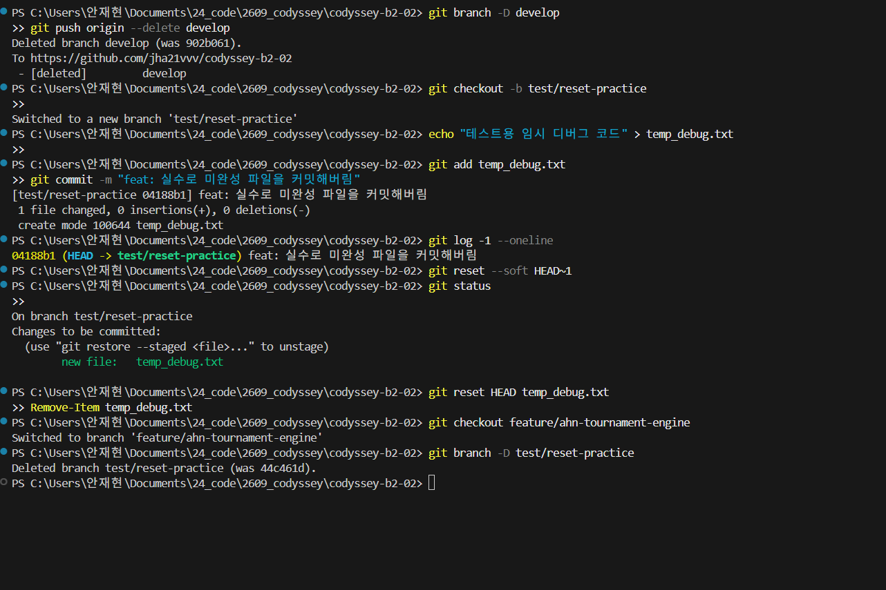
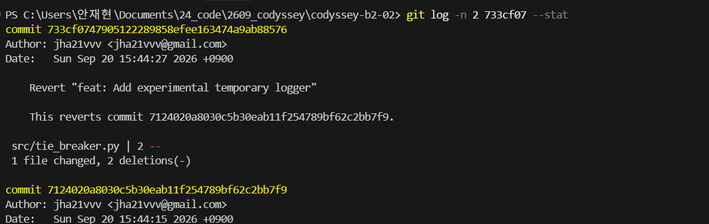

# Troubleshooting Log

> **과제 요구사항**: Git 트러블슈팅 실습 4종 시나리오를 팀 전체가 모두 수행하고 문서로 남긴다.  
> - 팀원별 최소 기준: 각 팀원은 최소 1개 시나리오의 해결 기록 작성에 참여해야 한다 (이름/역할 명시).

---

## 시나리오 1: `git commit --amend` (최근 커밋 메시지 수정)

### 참여자
- 담당: **강동하 (Deviskido)** — 사용자 요청에 따라 Codex가 명령 실행 및 기록
- 실습일: 2026-09-20
- 브랜치: `feature/kang-amend-practice`

### 상황
- 메시지 수정 실습을 위해 문서 변경을 오타가 있는 `docs: Ad amend practice log`로 커밋한다.
- push 전에 `Ad`를 `Add`로 수정한다. 기존 예시를 실제 수행 기록으로 교체하며, 파일 누락 실습은 포함하지 않는다.

### 시도한 명령/절차
```bash
git add docs/troubleshooting-log.md
git commit -m "docs: Ad amend practice log"
git log -1 --format='%H %T %s'
git commit --amend -m "docs: Add amend practice log"
git log -1 --format='%H %T %s'
git reflog -2
```

작성자 설정이 없는 환경이므로 실제 commit 명령에는
`git -c user.name=Deviskido -c user.email=314834139+Deviskido@users.noreply.github.com`
형태로 작성자 정보를 지정한다.

### 결과
- 수정 전: `e940da0698a0d9ec1052e9588198b7918da53788` — `docs: Ad amend practice log`
- 수정 후: [`075d0626d03afb45dfd2f8491cc385514780f8d8`](https://github.com/jha21vvv/codyssey-b2-02/commit/075d0626d03afb45dfd2f8491cc385514780f8d8) — `docs: Add amend practice log`
- 전후 tree 해시는 모두 `33506569b4b7795d9df0292c08080af84dce08e5`로 같아 파일 내용이 보존되었음을 확인했다.
- `git diff e940da0 075d062` 출력이 없음을 확인했다.
- 실제 `git reflog -2` 출력:

```text
075d062 HEAD@{0}: commit (amend): docs: Add amend practice log
e940da0 HEAD@{1}: commit: docs: Ad amend practice log
```

- 수정 전 커밋은 push하지 않았으며, reflog는 로컬 기록이므로 위 출력을 문서에 보존한다.
- 이 결과 기록은 amend 완료 후 별도 커밋으로 추가한다.

### 왜 이 방법을 선택했는가 (Why)
- 새 커밋을 추가하는 것만으로 기존 메시지가 수정되지는 않으므로 amend로 직전 커밋을 대체한다.
- 최초 push 전에 실습하여 공유 이력을 재작성하지 않고 일반 push로 결과를 공유한다.

---

## 시나리오 2: `git reset --soft HEAD~1` (로컬 커밋 취소 + 변경사항 유지)

### 참여자
- 작성 및 실습: **안재현**

### 실전 증빙 캡처


### 상황
- 기능 개발 브랜치(`test/reset-practice`)에서 커밋을 완료했으나, 실수로 미완성된 임시 디버그 파일(`temp_debug.txt`)이 커밋에 포함되어 버렸음을 인지함.
- 작성했던 작업 파일 내용은 단 1바이트도 유실하지 않고 Staged 상태로 유지한 채, 잘못 생성된 커밋 단위만 깔끔하게 취소하고자 함.

### 시도한 명령/절차
```bash
# 1. 취소할 커밋 생성 및 확인
git add temp_debug.txt
git commit -m "feat: 실수로 미완성 파일을 커밋해버림"
git log -1 --oneline
# 04188b1 (HEAD -> test/reset-practice) feat: 실수로 미완성 파일을 커밋해버림

# 2. soft reset 실행 (작업물 스테이징 유지)
git reset --soft HEAD~1

# 3. 스테이징 상태 및 파일 보존 확인
git status
# Changes to be committed:
#   (use "git restore --staged <file>..." to unstage)
#         new file:   temp_debug.txt
```

### 결과
- **취소 대상 커밋**: `04188b1` ("feat: 실수로 미완성 파일을 커밋해버림")
- 직전 커밋 `04188b1`은 브랜치 히스토리에서 말끔히 언커밋(Uncommit)되었으며, 작성했던 `temp_debug.txt` 변경사항은 Staged(인덱스) 상태 그대로 100% 안전하게 보존됨.
- 실습 전 과정을 `prove/01_an_trouble_shoting.png` 스크린샷으로 저장하여 시각적 증빙 확보 완료.

### 왜 이 방법을 선택했는가 (Why)
- `git reset --hard`를 사용하면 작업 트리의 모든 수정사항이 완전히 영구 삭제되어 복구하기 어렵다.
- 반면 `--soft` 옵션은 작업 트리의 파일을 그대로 보존하면서 커밋만 취소하므로, 실수로 포함된 파일을 분리하거나 메시지를 재검토할 때 가장 안전한 복구 수단이다.

---

## 시나리오 3: `git revert` (원격에 push된 커밋 취소)

### 참여자
- 작성 및 실습: **안재현, 김진우**
- 실습 브랜치: `feature/ahn-modify-lottery`

### 실전 증빙 캡처


### 상황
- 원격 저장소(`origin/feature/ahn-modify-lottery`)에 이미 push 완료된 기능 커밋(`7124020` - 임시 로거 추가)에 문제가 발생하여 이를 롤백해야 하는 상황 발생.
- 원격에 이미 푸시된 커밋은 다른 협업자에게 영향을 줄 수 있어 히스토리를 강제로 되돌리는 `reset`을 사용할 수 없으므로, 안전한 역커밋(Revert) 기법을 사용함.

### 시도한 명령/절차
```bash
# 1. 롤백 대상 원격 커밋 해시 확인
git log -1 --oneline
# 7124020 (HEAD -> feature/ahn-modify-lottery, origin/feature/ahn-modify-lottery) feat: Add experimental temporary logger

# 2. 안전한 역커밋(revert) 생성
git revert HEAD --no-edit
# [feature/ahn-modify-lottery 733cf07] Revert "feat: Add experimental temporary logger"
#  1 file changed, 2 deletions(-)

# 3. 새로운 취소 커밋 확인 및 원격 푸시
git log -2 --oneline
# 733cf07 Revert "feat: Add experimental temporary logger"
# 7124020 feat: Add experimental temporary logger
git push origin feature/ahn-modify-lottery
```

### 결과
- **취소 대상 원격 커밋**: [`7124020`](https://github.com/jha21vvv/codyssey-b2-02/commit/7124020) (`feat: Add experimental temporary logger`)
- **생성된 Revert 머지 커밋**: [`733cf07`](https://github.com/jha21vvv/codyssey-b2-02/commit/733cf07) (`Revert "feat: Add experimental temporary logger"`)
- 문제의 커밋이 변경했던 내용(2 deletions)이 정반대로 상쇄되는 새로운 Revert 커밋이 원격 브랜치에 안전하게 반영됨.
- 기존 협업 히스토리를 파괴하지 않으면서도 문제를 깔끔하게 원상 복구함.

### 왜 이 방법을 선택했는가 (Why)
- 이미 공유 원격 저장소에 push된 커밋에 대해 `reset` 후 `push --force`를 쓰면 다른 팀원들의 로컬 브랜치와 충돌이 발생해 협업이 마비된다.
- `revert`는 과거의 기록을 투명하게 남기면서 안전하게 롤백할 수 있는 실무 표준 롤백 기법이기 때문이다.

---

## 시나리오 4: `git stash` / `git stash pop` (작업 보관 후 전환)

### 참여자
- 작성 및 실습: **김진우**

### 실습 환경
- OS / 셸: Windows 11 / `cmd.exe`
- 작업 경로: `D:\cody\codyssey-b2-02`
- 실습 브랜치: `practice/stash-test2`
- 대상 파일: `src/voting.py`

### 상황
- `src/voting.py`에 기권(abstain) 처리 기능을 추가하던 중, `main`에 올라온 다른 팀원의 PR 머지 결과를 급히 확인해야 하는 요청을 받음.
- 작성 중이던 코드는 상수만 선언된 미완성 상태라 커밋할 수 없었고, 그렇다고 변경사항을 버릴 수도 없는 상황.

### 실제 실행 로그 (터미널 원문)
```text
D:\cody\codyssey-b2-02>git checkout main && git checkout -b practice/stash-test2
Already on 'main'
Your branch is ahead of 'origin/main' by 1 commit.
  (use "git push" to publish your local commits)
Switched to a new branch 'practice/stash-test2'

D:\cody\codyssey-b2-02>echo ABSTAIN = -1>> src\voting.py

D:\cody\codyssey-b2-02>git status --short
 M src/voting.py

D:\cody\codyssey-b2-02>git stash save "WIP: voting abstain handling"
Saved working directory and index state On practice/stash-test2: WIP: voting abstain handling

D:\cody\codyssey-b2-02>git status
On branch practice/stash-test2
nothing to commit, working tree clean

D:\cody\codyssey-b2-02>git stash list
stash@{0}: On practice/stash-test2: WIP: voting abstain handling

D:\cody\codyssey-b2-02>git checkout main
Switched to branch 'main'
Your branch is ahead of 'origin/main' by 1 commit.
  (use "git push" to publish your local commits)

D:\cody\codyssey-b2-02>findstr ABSTAIN src\voting.py

D:\cody\codyssey-b2-02>git checkout practice/stash-test2
Switched to branch 'practice/stash-test2'

D:\cody\codyssey-b2-02>git stash pop
On branch practice/stash-test2
Changes not staged for commit:
  (use "git add <file>..." to update what will be committed)
  (use "git restore <file>..." to discard changes in working directory)
        modified:   src/voting.py

no changes added to commit (use "git add" and/or "git commit -a")
Dropped refs/stash@{0} (95a59078d60ccd7776c0df87c700abb5f92a689a)

D:\cody\codyssey-b2-02>git status --short && git stash list
 M src/voting.py

D:\cody\codyssey-b2-02>git checkout -- src\voting.py && git checkout main && git branch -D practice/stash-test
Switched to branch 'main'
Your branch is ahead of 'origin/main' by 1 commit.
  (use "git push" to publish your local commits)
Deleted branch practice/stash-test (was 6e836e0).
```

### 단계별 해설
| 단계 | 명령 | 확인 포인트 |
|:---|:---|:---|
| 1 | `echo ABSTAIN = -1>> src\voting.py` | 미완성 변경 생성 → `git status --short`에 ` M src/voting.py` |
| 2 | `git stash save "WIP: voting abstain handling"` | 작업물이 stash 스택에 보관됨 |
| 3 | `git status` | `nothing to commit, working tree clean` — 작업 트리가 비워짐 |
| 4 | `git stash list` | `stash@{0}: On practice/stash-test2: ...` — 스택에 정상 적재 |
| 5 | `git checkout main` | 브랜치 전환 성공 (stash 덕분에 충돌 없음) |
| 6 | `findstr ABSTAIN src\voting.py` | **출력 없음** = `main`에 WIP가 섞이지 않음을 증명 |
| 7 | `git stash pop` | `modified: src/voting.py` 복원 + `Dropped refs/stash@{0} (95a5907...)` |
| 8 | `git stash list` | **출력 없음** = pop과 동시에 스택에서 제거됨 |

### 결과
- 미완성 코드를 `temp`, `wip` 같은 더미 커밋으로 남기지 않고도 작업 트리를 비워 안전하게 브랜치를 오갈 수 있었음.
- 복귀 후 `git stash pop` 한 번으로 작업이 그대로 복원되었고, 스택에서도 정상 제거됨(`Dropped refs/stash@{0} (95a59078d60ccd7776c0df87c700abb5f92a689a)`).
- 6단계의 `findstr` 결과가 비어 있다는 점이 핵심 증빙임. stash 하지 않고 전환했다면 미커밋 변경이 `main`까지 따라와 `ABSTAIN = -1`이 출력되었을 것임.
- 실습에 사용한 기권 처리 코드는 검증용 미완성 초안이었으므로 `git checkout -- src\voting.py`로 폐기함.

### 주의할 점 (Pitfall)
- **커밋하지 않은 변경은 브랜치 전환 시 따라온다.** Git은 충돌이 없으면 작업 트리의 변경을 그대로 들고 이동하므로, stash 없이 `git checkout`하면 A 브랜치의 미완성 코드를 B 브랜치에서 실수로 커밋할 수 있음. 6단계는 이를 방지했음을 확인하는 절차임.
- 추적되지 않는 새 파일(Untracked file)은 `git stash`에 포함되지 않으므로 `git stash -u` 옵션이 필요함.
- `git stash pop`은 복원과 동시에 스택에서 제거하므로, 스택에 남겨두고 싶다면 `git stash apply`를 사용해야 함.
- `git stash`는 **로컬 전용**이라 원격에 푸시되지 않음. 따라서 실습 증빙은 위 터미널 로그로 남김.

### 왜 이 방법을 선택했는가 (Why)
- Git 히스토리에 의미 없는 `temp`, `wip` 커밋을 남기는 것을 원천 차단하면서, 컨텍스트 스위칭을 가장 빠르고 깔끔하게 수행할 수 있는 전용 도구이기 때문임.
- `git commit` 후 `git reset`으로 되돌리는 우회 방법도 있으나, 미완성 코드가 히스토리에 잠시라도 올라가고 되돌리는 절차가 더 번거로워 이 상황에는 stash가 가장 적합함.
