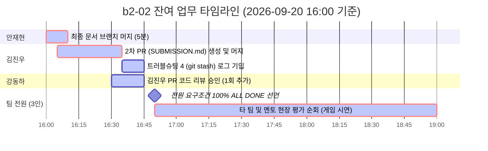

# 📌 [b2-02] 프로젝트 잔여 업무 리스트 (To-Do List)

> **기준 일시**: **2026년 9월 20일(일) 16:00 (KST)**  
> **프로젝트**: **한국 음식 128선 식사 추천 이상형 월드컵 (코디세이 b2-02)**  
> **팀원**: 👑 안재현(Lead), 🛠️ 강동하, 📋 김진우  
> **전체 진행률**: **90% 완료 (최종 마무리 단계)**

---

## 📊 1. 팀원별 진행 상황 및 남은 일 요약

---

## 👑 2. 안재현 (Lead) — 잔여 업무 (예상 소요시간: 5분)

| 상태 | 업무 내용 | 상세 설명 및 액션 |
|:---:|:---|:---|
| ⏳ **대기** | **최종 문서 브랜치 `main` 머지** | 비자명 충돌(`6a9cfd6`), `revert`(`733cf07`), 캡처 사진들이 담긴 `feature/ahn-modify-lottery` 브랜치를 `main`으로 PR 올려서 머지하기. 👉 **[PR 생성 링크](https://github.com/jha21vvv/codyssey-b2-02/pull/new/feature/ahn-modify-lottery)** |
| ⏳ **대기** | **김진우 2차 PR 승인(Approve)** | 김진우 님이 `SUBMISSION.md` 완결 PR을 올리면 내용 검토 후 승인 도장 찍기. |

---

## 🛠️ 3. 강동하 — 잔여 업무 (예상 소요시간: 5분)

| 상태 | 업무 내용 | 상세 설명 및 액션 |
|:---:|:---|:---|
| ⏳ **대기** | **코드 리뷰 1회 추가 작성** | 현재까지 안재현 PR 리뷰 1회 완료 상태. 과제 기준(최소 2회) 충족을 위해 **김진우 님의 2차 PR(또는 안재현 PR)에 인라인 코드 리뷰 및 Approve 남기기**. |
| ⏳ **대기** | **현장 평가 순회 동행** | 16:50~19:00 동안 타 팀 부스를 돌며 완성된 음식 월드컵 게임 시연 및 상호 평가 진행. |

---

## 📋 4. 김진우 — 잔여 업무 (예상 소요시간: 20분)

| 상태 | 업무 내용 | 상세 설명 및 액션 |
|:---:|:---|:---|
| 🚨 **필수** | **2번째 PR 생성 및 머지 (`SUBMISSION.md`)** | 1인당 최소 PR 2개 요건 충족을 위해 `feature/kim-submission-final` 브랜치에서 `SUBMISSION.md` 최종 링크들을 채운 후 2차 PR 발행 및 머지 완료하기. |
| 🚨 **필수** | **트러블슈팅 4 (`git stash`) 실제 로그 기입** | 터미널에서 `git stash` ➔ `git stash list` 실행 결과를 `docs/troubleshooting-log.md` 시나리오 4번에 기입하기. |

---

## 🏆 5. 팀 전체 최종 종결 체크리스트 (ALL DONE 마감)

- [x] 팀원 전원 1차 PR 머지 완료 (안재현 PR #2, 강동하 PR #6, 김진우 PR #4)
- [x] 안재현 2차 PR 머지 완료 (`src/game.py`, PR #12)
- [x] 강동하 2차 PR 머지 완료 (`docs/CONTRIBUTING.md`, PR #9)
- [ ] 김진우 2차 PR 머지 (`SUBMISSION.md`, PR 발행 예정)
- [x] 충돌 1회차 완료: `data/food_data.json` 인접 라인 (`fafaa6d`, PR #7, 사진 첨부)
- [x] 충돌 2회차 완료: `lottery.py` ➔ `tie_breaker.py` 비자명 충돌 (`6a9cfd6`, 사진 첨부)
- [x] 트러블 1 완료: `git commit --amend` (강동하, `075d062`)
- [x] 트러블 2 완료: `git reset --soft` (안재현, `04188b1`, 사진 첨부)
- [x] 트러블 3 완료: `git revert` (안재현/김진우, `7124020` ➔ `733cf07`, 사진 첨부)
- [ ] 트러블 4 완료: `git stash` (김진우 로그 기입 대기)
- [ ] `main` 브랜치에 최종 증빙 문서 병합 완료

---

> **기록 작성자**: 안재현 (Lead Architect)  
> **마지막 업데이트**: 2026-09-20 16:00 KST