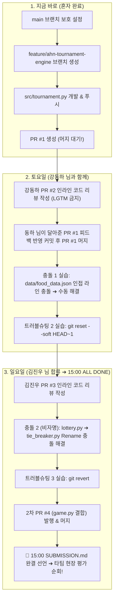

# 👑 [안재현] b2-02 초심플 실무 가이드 & AI 복붙 프롬프트

> **과제 미션**: **코디세이 b2-02 (3~5인 Git 실전 협업 시뮬레이션)**  
> **개발 프로젝트**: **한국 음식 128선 식사 추천 이상형 월드컵 (Python 게임)**  
> **담당자**: **안재현 (Lead Architect & Repository Admin)**  
> **마감 시한**: **일요일 15:00 전 기능 & 문서 100% ALL DONE ➔ 15:00~19:00 현장 평가**

---

## ⚡ [지금 당장 할 일 3단계] (초간단 실행 가이드)

지금 안재현 님이 혼자서 진행하실 내용은 딱 아래 **3단계**입니다:

### 1단계: GitHub 웹에서 `main` 브랜치 잠그기 (30초)
1. GitHub 저장소 페이지 상단 **[Settings]** ➔ 왼쪽 메뉴 **[Branches]** 클릭
2. **[Add branch protection rule]** (또는 `Add branch ruleset`) 클릭
3. **Branch name pattern**에 `main` 입력
4. **`Require a pull request before merging`** 체크 (Require approvals: `1`)
5. 맨 아래 **[Save changes]** 클릭 완료!

---

### 2단계: 내 브랜치 만들어서 토너먼트 코드(`tournament.py`) 올리기
터미널에서 아래 명령어를 순서대로 입력합니다:

```bash
# 1) 안재현 전용 기능 브랜치 생성 및 이동
git checkout -b feature/ahn-tournament-engine

# 2) src/tournament.py 파일 생성 및 코드 작성 (아래 부록 코드 복사)

# 3) 커밋하기 (규칙 준수: feat 접두사 사용)
git add src/tournament.py
git commit -m "feat: Implement tournament bracket engine and round manager"

# 4) 깃허브 원격 저장소로 푸시
git push origin feature/ahn-tournament-engine
```

---

### 3단계: GitHub 웹에서 PR #1 올리고 대기하기 (머지 금지!)
1. GitHub 저장소 상단에 뜨는 초록색 **[Compare & pull request]** 버튼 클릭!
2. 제목: `feat: Implement tournament bracket engine (Closes #1)`
3. 본문에 아래 내용 그대로 복사해서 붙여넣고 **[Create pull request]** 클릭:
   ```markdown
   Closes #1

   ## 변경 사항 (What)
   - 32/16/8강 대진표 생성 알고리즘 구현 (src/tournament.py)
   - 라운드 매치 페어링 및 승자 진출 트리 상태머신 구현

   ## 변경 이유 (Why)
   - 식사 추천 월드컵 게임의 코어 대진 및 승자 판정 로직 제공

   ## 테스트 / 검증 (How)
   - [x] python src/tournament.py 단위 테스트 시뮬레이션 통과
   - [x] 홀수 및 비정상 입력 방어 로직 검증 완료
   ```
4. 🚨 **[주의] PR을 생성만 해두고, 초록색 [Merge pull request] 버튼은 절대 누르지 마세요!**  
   강동하 님이 인라인 리뷰 댓글을 달아준 뒤, 피드백 반영 커밋을 올리고 승인(Approve)을 받아야 과제 점수 만점이 나옵니다.

---

## 📅 [앞으로 순서대로 진행할 전체 로드맵]

안재현 님이 토요일, 일요일까지 팀원들과 합을 맞추며 진행할 순서입니다:



---

## 🛠️ 업무별 상세 복붙 프롬프트 모음

### 📋 [토요일 업무] 강동하 PR #2 코드 리뷰 복붙용
강동하 님이 올린 PR #2의 "Files changed" 탭에서 `src/food_loader.py` 라인에 달아줄 고품질 피드백입니다:
> **코멘트 내용**:  
> `"src/food_loader.py: sample_foods 함수에서 count 인자가 전체 음식 수(128개)를 초과하거나 2의 거듭제곱(8, 16, 32)이 아닐 경우 프로그램 안정성을 위해 ValueError를 일으키는 방어 로직이 필요해 보입니다. 추가 검토 부탁드립니다!"`

### 📋 [토요일 업무] 충돌 실습 1회차 해결 (`data/food_data.json`)
- **상황**: 안재현 브랜치는 10번 라인에 `"순두부찌개"` 추가, 강동하 브랜치는 10번 라인에 `"부대찌개"` 추가하여 머지 충돌 유발.
- **해결**: 충돌 마커(`<<<<<<< HEAD`) 확인 후 둘 다 살리는 **Keep both** 방식으로 편집 후 커밋:
  ```bash
  git add data/food_data.json
  git commit -m "fix: Resolve merge conflict in food_data.json by keeping both dishes"
  git push origin feature/ahn-tournament-engine
  ```
- `docs/conflict-resolution.md`에 충돌 기록 #1 작성 완료.

### 📋 [토요일 업무] 트러블슈팅 2 실습 (`git reset --soft HEAD~1`)
```bash
# 1. 파일 누락된 상태로 임시 커밋 생성
git commit -m "feat: Add tournament engine draft"

# 2. 커밋만 취소하고 작업 파일은 Staged 상태로 보존
git reset --soft HEAD~1

# 3. git status로 파일 보존 확인 후 완벽한 상태로 재커밋
git commit -m "feat: Implement tournament engine with input validation"
```
- `docs/troubleshooting-log.md`에 시나리오 2 작성 완료.

---

## 📦 부록: 안재현 담당 `src/tournament.py` 완벽 구현 코드

2단계에서 `src/tournament.py` 파일에 복사해서 넣을 검증된 파이썬 코드입니다:

```python
"""
Tournament Engine Module
Authored by: 안재현 (Lead Architect)
Part of Codyssey b2-02 Korean Food Tournament.
"""

from typing import List, Dict, Tuple, Optional


class TournamentEngine:
    """
    32강 / 16강 / 8강 토너먼트 대진 브래킷 상태 머신
    """
    def __init__(self, foods: List[Dict]):
        if len(foods) not in (8, 16, 32, 64, 128):
            raise ValueError(f"음식 개수는 2의 거듭제곱이어야 합니다. 현재: {len(foods)}개")
        self.initial_foods = list(foods)
        self.current_round_foods = list(foods)
        self.next_round_foods: List[Dict] = []
        self.current_match_index = 0
        self.history: List[Dict] = []

    @property
    def current_round_name(self) -> str:
        count = len(self.current_round_foods)
        if count == 2:
            return "결승전"
        elif count == 4:
            return "준결승 (4강)"
        return f"{count}강"

    @property
    def total_matches_in_round(self) -> int:
        return len(self.current_round_foods) // 2

    def get_current_match(self) -> Optional[Tuple[Dict, Dict]]:
        if self.is_tournament_finished():
            return None
        idx = self.current_match_index * 2
        return (self.current_round_foods[idx], self.current_round_foods[idx + 1])

    def advance_winner(self, winner: Dict) -> bool:
        """
        현재 매치의 승자를 다음 라운드 진출 목록에 추가
        반환값: 해당 라운드가 모두 끝나서 다음 라운드로 전환되었으면 True
        """
        match = self.get_current_match()
        if not match:
            raise ValueError("진행할 매치가 없습니다.")
        if winner not in match:
            raise ValueError(f"승자 {winner.get('name')}는 현재 대진 매치에 포함되어 있지 않습니다.")

        self.next_round_foods.append(winner)
        self.history.append({
            "round": self.current_round_name,
            "match": self.current_match_index + 1,
            "food_a": match[0],
            "food_b": match[1],
            "winner": winner
        })
        self.current_match_index += 1

        # 현재 라운드의 모든 매치가 끝났을 때
        if self.current_match_index >= self.total_matches_in_round:
            if len(self.next_round_foods) > 1:
                self.current_round_foods = list(self.next_round_foods)
                self.next_round_foods = []
                self.current_match_index = 0
                return True
            else:
                return True
        return False

    def is_tournament_finished(self) -> bool:
        return len(self.current_round_foods) == 1 or (
            len(self.current_round_foods) == 2 and len(self.next_round_foods) == 1
        )

    def get_final_champion(self) -> Optional[Dict]:
        if len(self.current_round_foods) == 1:
            return self.current_round_foods[0]
        if len(self.next_round_foods) == 1 and len(self.current_round_foods) == 2:
            return self.next_round_foods[0]
        return None


if __name__ == "__main__":
    # 단위 테스트 및 시뮬레이션
    mock_foods = [
        {"id": i, "name": f"음식_{i}", "category": "한식", "desc": "설명"}
        for i in range(1, 9)
    ]
    engine = TournamentEngine(mock_foods)
    print(f"시작 라운드: {engine.current_round_name}")
    while not engine.is_tournament_finished():
        match = engine.get_current_match()
        if not match:
            break
        print(f"[{engine.current_round_name} {engine.current_match_index+1}경기] {match[0]['name']} vs {match[1]['name']}")
        engine.advance_winner(match[0])

    champ = engine.get_final_champion()
    print(f"\n최종 우승 음식: {champ['name']}!")
```
